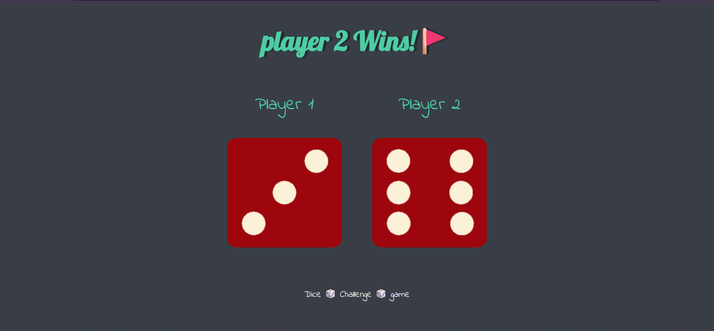
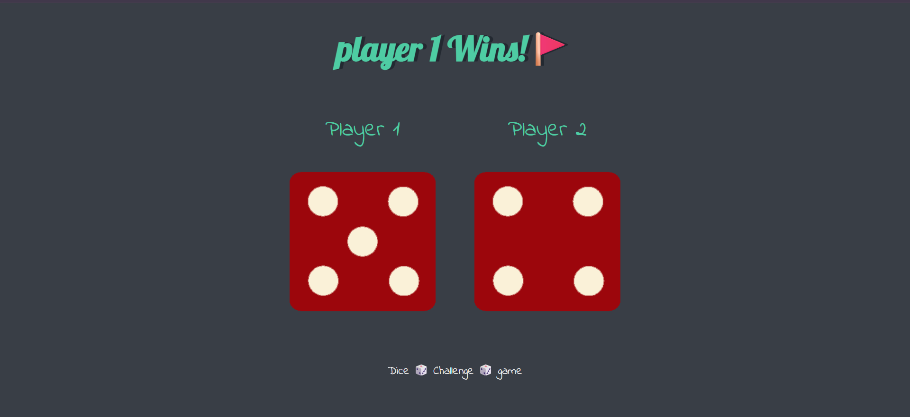
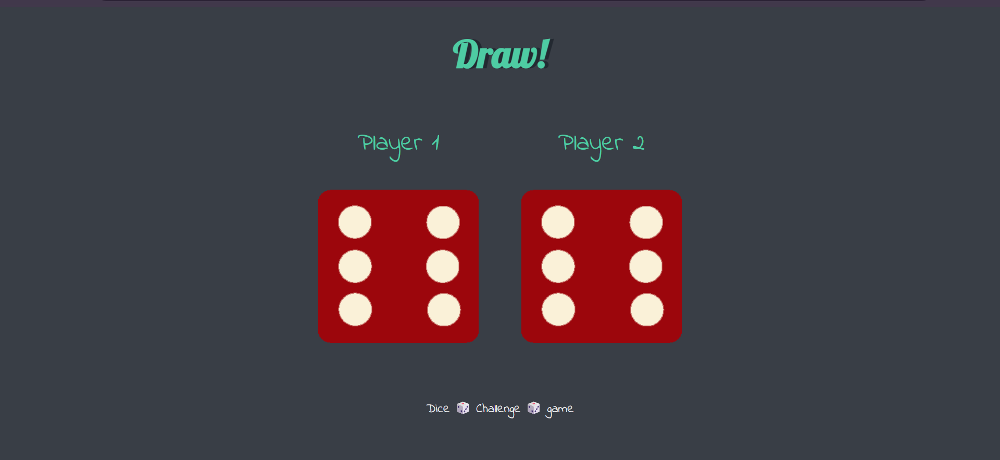

## Dice Challenge Game ##
A simple yet interactive web-based game where two players compete based on the roll of the dice. No buttons required—the winner is decided by the luck of the refresh!

## How it Works ##
When the browser is refreshed, the JavaScript logic executes automatically.
Two random numbers between 1 and 6 are generated.
The dice images update dynamically to match the generated numbers.
The title (h6) changes to declare the winner:
🚩 Player 1 Wins! (If Dice 1 > Dice 2)
Player 2 Wins! 🚩 (If Dice 2 > Dice 1)
Draw! (If both dice are equal)

## Technologies Used ##
HTML5: For the structural layout.
CSS3: For styling the dice, typography, and responsive design.
JavaScript (ES6): For generating random numbers and manipulating the DOM.

## Preview ##

